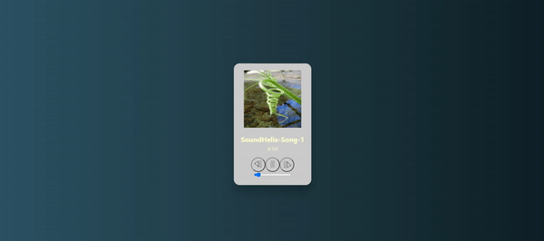

<p align="center">
  
</p>

### WHAT
Music player :)

### HOW

made using

```
yarn create next-app
yarn add styled-components
```

run using

```
yarn dev
```

Open [http://localhost:3000](http://localhost:3000) with your browser to see the result.


### REF

https://letsbuildui.dev/articles/building-an-audio-player-with-react-hooks   
https://reactjs.org/docs/react-component.html   
https://dev.to/david4473/working-with-images-in-next-js-48d6   
https://stackoverflow.com/questions/47686345/playing-sound-in-react-js   